# SET09803: DevOps Coursework (Group 22)

## Project Badges

### Main Workflow

### License

### Latest Release

---

## Build Status by Branch

### master Branch

### develop Branch

---

## Code Coverage (Codecov)

### master Branch

### develop Branch

---

# Project Overview

This project is a DevOps-based Java application that generates population and geographic reports using the MySQL World Database.

It includes full implementation of all 32 coursework requirements, generating Markdown reports for:

- Countries
- Cities
- Capital cities
- Top-N population lists
- Population breakdowns (continent, region, country)
- Single population queries
- Language population statistics

Continuous integration, unit tests, integration tests, and code coverage ensure reliability and correctness.

---

# Database Schema (World DB)

The application uses the standard `world.sql` dataset containing:

- `country`
- `city`
- `countrylanguage`

### ERD Diagram

---

# Coursework Requirement Completion

There are 32 requirements in total.

**32 out of 32 requirements implemented (100%).**

---

## Requirements Table

| ID | Requirement                                                                                                      | Met | Screenshot                                           |
|----|------------------------------------------------------------------------------------------------------------------|-----|------------------------------------------------------|
| 1  | All the countries in the world organised by largest population to smallest.                                      | Yes |  |
| 2  | All the countries in a continent organised by largest population to smallest.                                    | Yes | 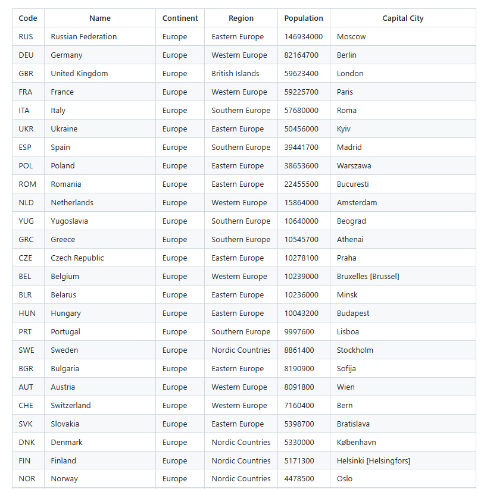 |
| 3  | All the countries in a region organised by largest population to smallest.                                       | Yes | 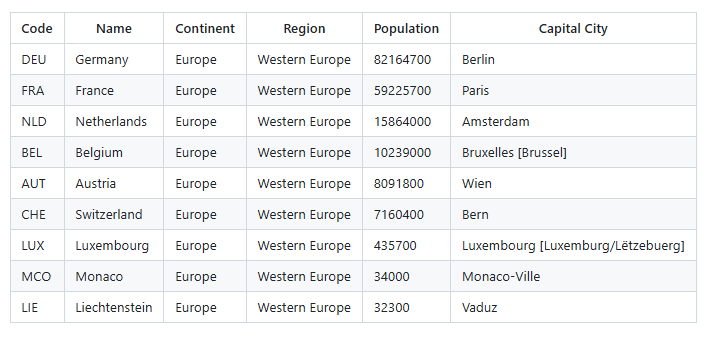 |
| 4  | The top N populated countries in the world where N is provided by the user.                                      | Yes | 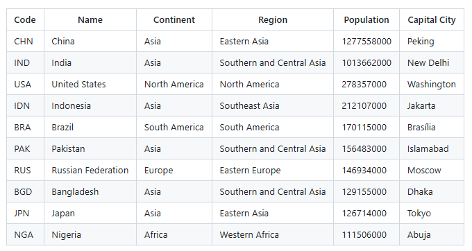 |
| 5  | The top N populated countries in a continent where N is provided by the user.                                    | Yes | 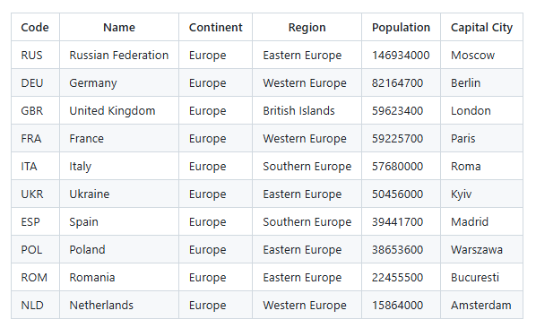 |
| 6  | The top N populated countries in a region where N is provided by the user.                                       | Yes | 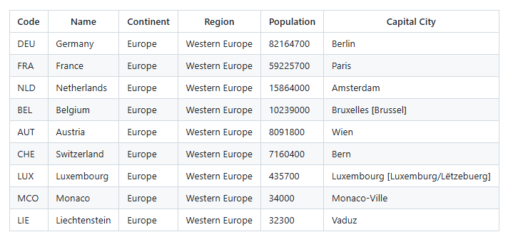 |
| 7  | All the cities in the world organised by largest population to smallest.                                         | Yes | 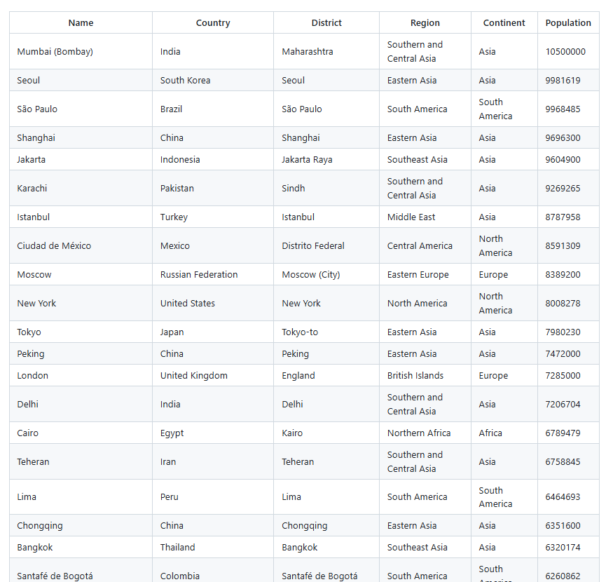 |
| 8  | All the cities in a continent organised by largest population to smallest.                                       | Yes | 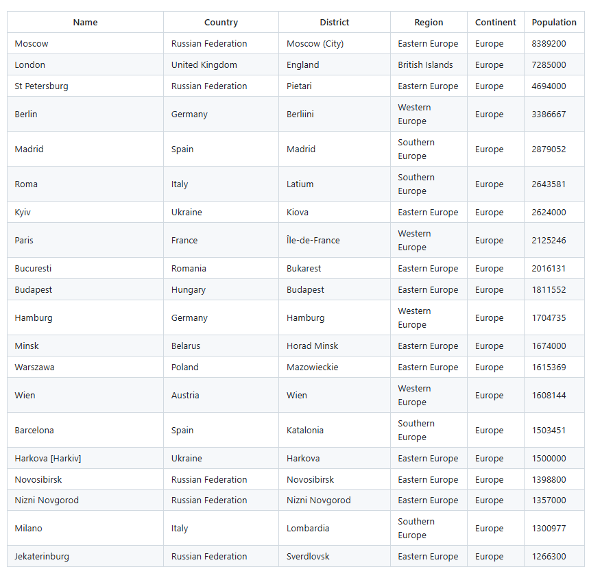 |
| 9  | All the cities in a region organised by largest population to smallest.                                          | Yes | 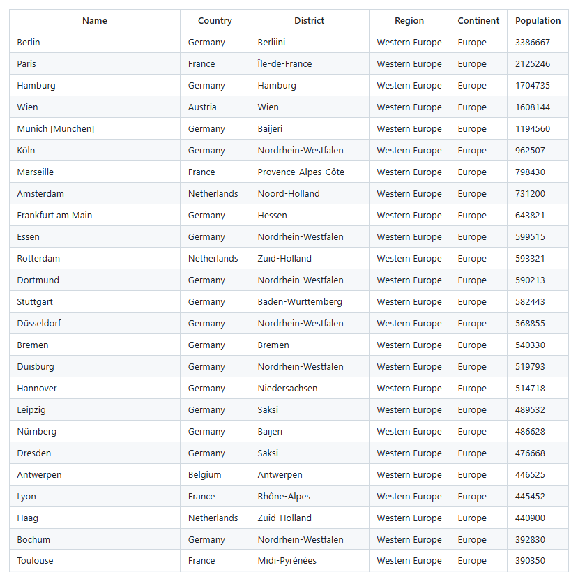 |
| 10 | All the cities in a country organised by largest population to smallest.                                         | Yes | 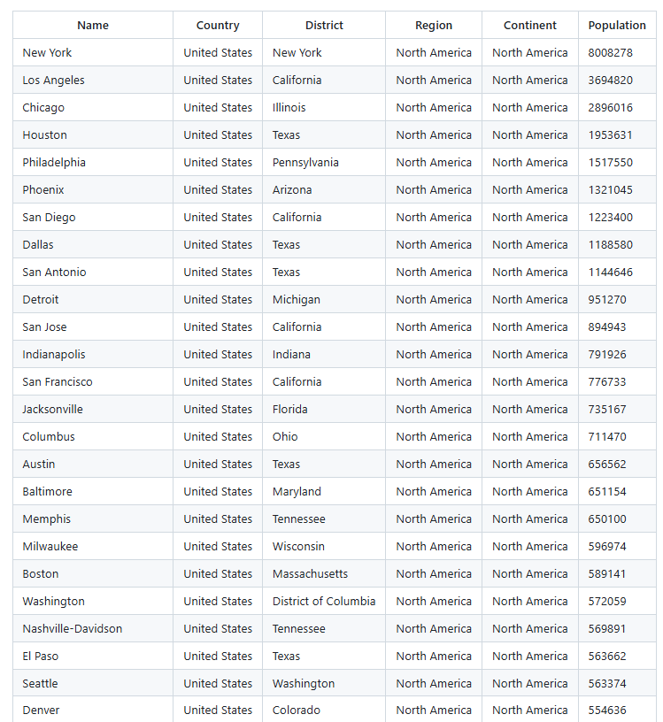 |
| 11 | All the cities in a district organised by largest population to smallest.                                        | Yes | 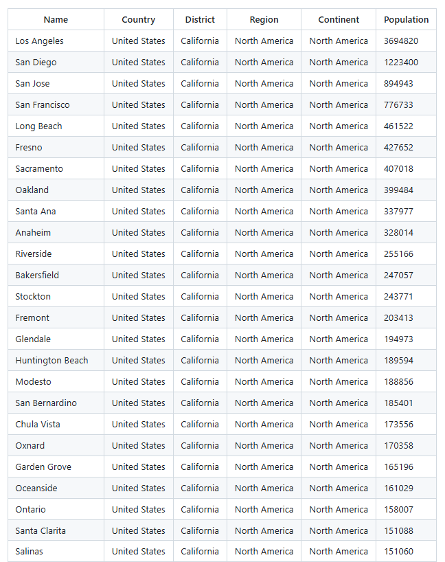 |
| 12 | The top N populated cities in the world where N is provided by the user.                                         | Yes | 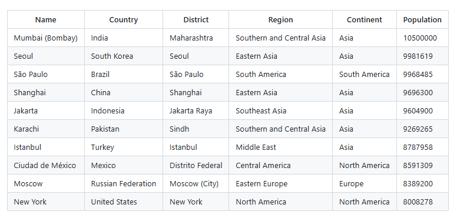 |
| 13 | The top N populated cities in a continent where N is provided by the user.                                       | Yes | 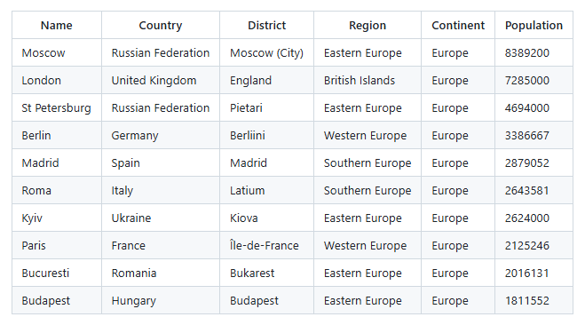 |
| 14 | The top N populated cities in a region where N is provided by the user.                                          | Yes | 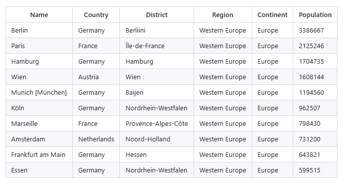 |
| 15 | The top N populated cities in a country where N is provided by the user.                                         | Yes |  |
| 16 | The top N populated cities in a district where N is provided by the user.                                        | Yes | 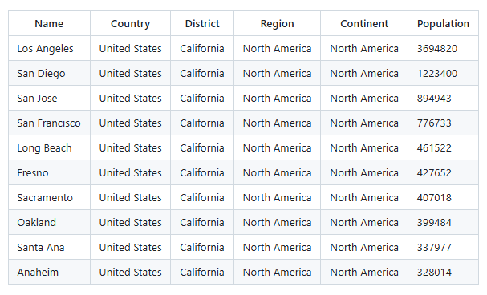 |
| 17 | All the capital cities in the world organised by largest population to smallest.                                 | Yes | 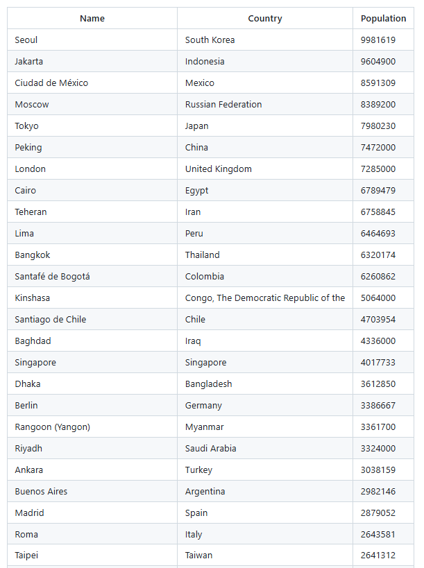 |
| 18 | All the capital cities in a continent organised by largest population to smallest.                               | Yes | 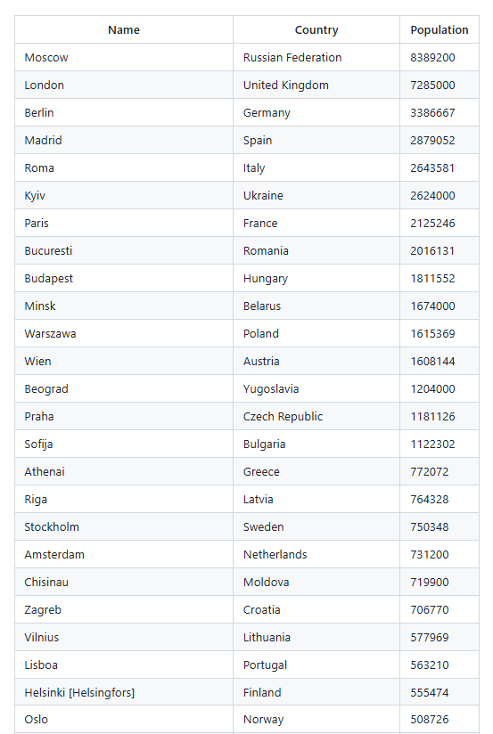 |
| 19 | All the capital cities in a region organised by largest to smallest.                                             | Yes | 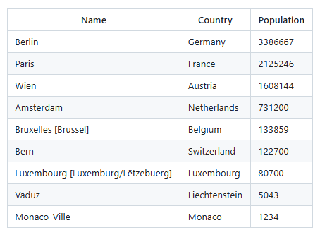 |
| 20 | The top N populated capital cities in the world where N is provided by the user.                                 | Yes | 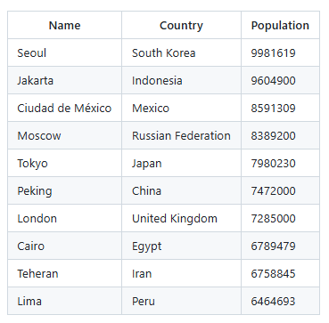 |
| 21 | The top N populated capital cities in a continent where N is provided by the user.                               | Yes | 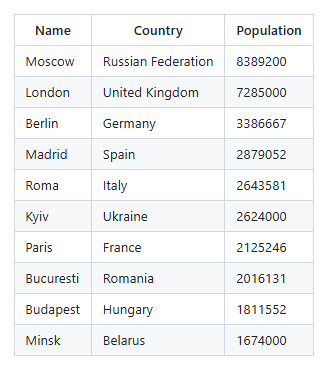 |
| 22 | The top N populated capital cities in a region where N is provided by the user.                                  | Yes | 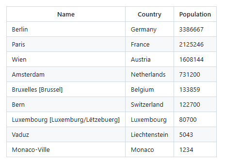 |
| 23 | Population, city population, and non-city population in each continent.                                          | Yes | 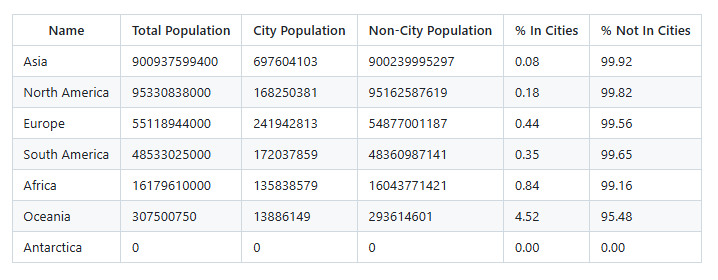 |
| 24 | Population, city population, and non-city population in each region.                                             | Yes | 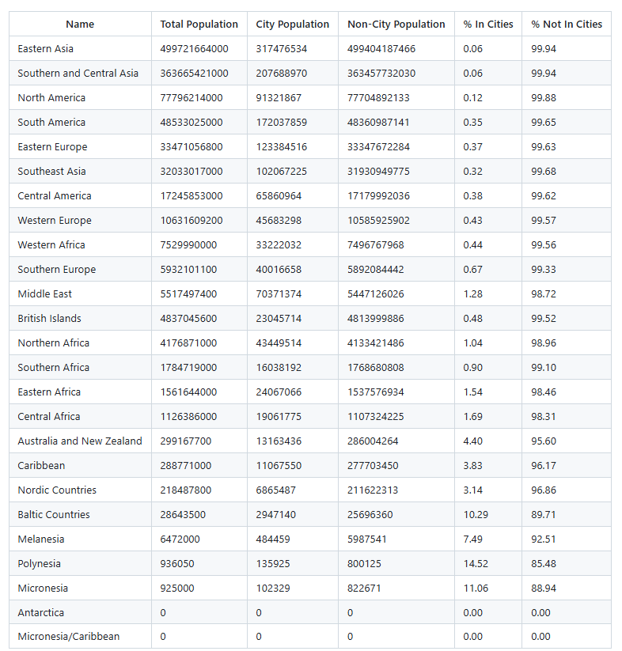 |
| 25 | Population, city population, and non-city population in each country.                                            | Yes | 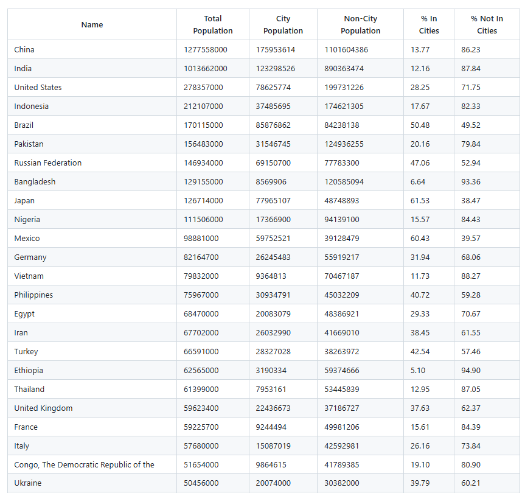 |
| 26 | Speakers of Chinese, English, Hindi, Spanish, Arabic + % of world population.                                    | Yes | 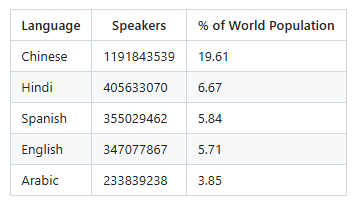 |
| 27 | The population of the world.                                                                                      | Yes | 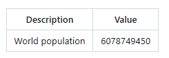 |
| 28 | The population of a continent.                                                                                    | Yes | 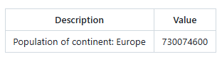 |
| 29 | The population of a region.                                                                                       | Yes | 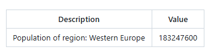 |
| 30 | The population of a country.                                                                                      | Yes | 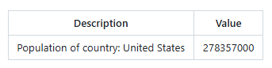 |
| 31 | The population of a district.                                                                                     | Yes | 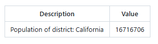 |
| 32 | The population of a city.                                                                                         | Yes | 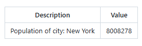 |

---
